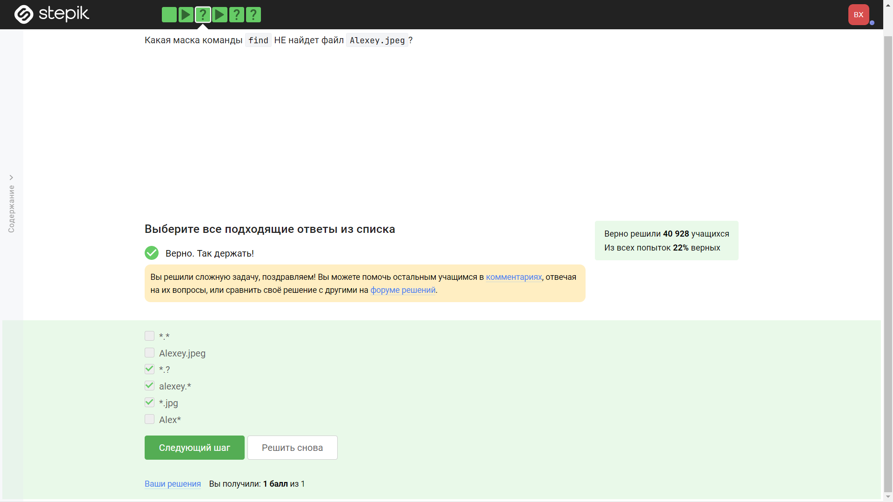

---
## Front matter
title: "Отчёт по рохождению внешних курсов"
subtitle: "Часть 1. Введение"
author: "Хрусталев Влад"

## Generic otions
lang: ru-RU
toc-title: "Содержание"

## Bibliography
bibliography: bib/cite.bib
csl: pandoc/csl/gost-r-7-0-5-2008-numeric.csl

## Pdf output format
toc: true # Table of contents
toc-depth: 2
lof: true # List of figures
lot: true # List of tables
fontsize: 12pt
linestretch: 1.5
papersize: a4
documentclass: scrreprt
## I18n polyglossia
polyglossia-lang:
  name: russian
  options:
	- spelling=modern
	- babelshorthands=true
polyglossia-otherlangs:
  name: english
## I18n babel
babel-lang: russian
babel-otherlangs: english
## Fonts
mainfont: PT Serif
romanfont: PT Serif
sansfont: PT Sans
monofont: PT Mono
mainfontoptions: Ligatures=TeX
romanfontoptions: Ligatures=TeX
sansfontoptions: Ligatures=TeX,Scale=MatchLowercase
monofontoptions: Scale=MatchLowercase,Scale=0.9
## Biblatex
biblatex: true
biblio-style: "gost-numeric"
biblatexoptions:
  - parentracker=true
  - backend=biber
  - hyperref=auto
  - language=auto
  - autolang=other*
  - citestyle=gost-numeric
## Pandoc-crossref LaTeX customization
figureTitle: "Рис."
tableTitle: "Таблица"
listingTitle: "Листинг"
lofTitle: "Список иллюстраций"
lotTitle: "Список таблиц"
lolTitle: "Листинги"
## Misc options
indent: true
header-includes:
  - \usepackage{indentfirst}
  - \usepackage{float} # keep figures where there are in the text
  - \floatplacement{figure}{H} # keep figures where there are in the text
---

# Цель работы

Изучить самые первоночальные данные о Linux.

# Выполнение лабораторной работы

Вопрос 1: (рис. @fig:001).

{#fig:001 width=70%}

Пояснение ответа 1: Поясление не требуется.

Вопрос 2: (рис. @fig:002).

{#fig:002 width=70%}

Пояснение ответа 2: Поясление не требуется.

Вопрос 3: (рис. @fig:003).

{#fig:003 width=70%}

Пояснение ответа 3: Поясление не требуется.

Вопрос 4: (рис. @fig:004).

{#fig:004 width=70%}

Пояснение ответа 4: Поясление не требуется.

Вопрос 5: (рис. @fig:005).

{#fig:005 width=70%}

Пояснение ответа 5: Поясление не требуется.

Вопрос 6: (рис. @fig:006).

{#fig:006 width=70%}

Пояснение ответа 6: Всё было выполнено ровно так, как требовало задание.

Вопрос 7: (рис. @fig:007).

{#fig:007 width=70%}

Пояснение ответа 7: deb - установочные пакеты linux.

Вопрос 8: (рис. @fig:008).

{#fig:008 width=70%}

Пояснение ответа 8: Всё сделали по инструкции.

Вопрос 9: (рис. @fig:009).

{#fig:009 width=70%}

Пояснение ответа 9: Поясление не требуется.

Вопрос 10: (рис. @fig:010).

{#fig:010 width=70%}

Пояснение ответа 10: Консоль == Терминал.

Вопрос 11: (рис. @fig:011).

{#fig:011 width=70%}

Пояснение ответа 11: pwd - команда для отображение полного пути к дирректории, влиеяет регистр букв.

Вопрос 12: (рис. @fig:012).

{#fig:012 width=70%}

Пояснение ответа 12: "-A" == "--almost-all" , "-h" == "--human-redable" -> исходя из этих данные выбираем ответы.

Вопрос 13: (рис. @fig:013).

{#fig:013 width=70%}

Пояснение ответа 13: "/home/bi" == "~" и мы сейчас тут. У нас 3 варианта перейти в Downloads: полный путь через один из варинатов домашнего католга и переход вперед по иерархии. 

Вопрос 14: (рис. @fig:014).

{#fig:014 width=70%}

Пояснение ответа 14: Ключ -r в команде rm (remove) представляет рекурсивное удаление. Он используется для удаления файлов и директорий вместе со всем их содержимым.

Вопрос 15: (рис. @fig:015).

{#fig:015 width=70%}

Пояснение ответа 15: exit не предусмотренно в firefox.

Вопрос 16: (рис. @fig:016).

{#fig:016 width=70%}

Пояснение ответа 16: То есть пауза(Ctrl+Z), потом востановление работы но фоном командой bg.

Вопрос 17: (рис. @fig:017).

{#fig:017 width=70%}

Пояснение ответа 17: Пояснение не требуется.

Вопрос 18: (рис. @fig:018).

{#fig:018 width=70%}

Пояснение ответа 18: Пояснение не требуется.

Вопрос 19: (рис. @fig:019).

{#fig:019 width=70%}

Пояснение ответа 19: "2" - указывает на поток ошибок ">" и ">>" куда передавать поток.

Вопрос 20: (рис. @fig:020).

{#fig:020 width=70%}

Пояснение ответа 20: Пояснение не требуется.

Вопрос 21: (рис. @fig:021).

{#fig:021 width=70%}

Пояснение ответа 21: Пояснение не требуется.

Вопрос 22: (рис. @fig:022).

{#fig:022 width=70%}

Пояснение ответа 22: "-q" - уюрает вывод на экран.

Вопрос 23: (рис. @fig:023).

{#fig:023 width=70%}

Пояснение ответа 23: -r: Рекурсивная загрузка. Этот ключ указывает wget загружать ресурсы рекурсивно, то есть загружать не только указанный файл, но и все связанные файлы, которые он ссылается. -l 1: Максимальная глубина загрузки. Этот ключ ограничивает глубину рекурсивной загрузки до указанного уровня. В данном случае -l 1 означает, что загрузка будет происходить только на один уровень вниз от начального файла. -A jpg: Ограничение на тип файлов. Этот ключ указывает wget загружать только файлы с указанным расширением. В данном случае -A jpg указывает на загрузку файлов с расширением .jpg.

Вопрос 24: (рис. @fig:024).

{#fig:024 width=70%}

Пояснение ответа 24: Поянения не требует.

Вопрос 25: (рис. @fig:025).

{#fig:025 width=70%}

Пояснение ответа 25: gzip - не архиватор.

Вопрос 26: (рис. @fig:026).

{#fig:026 width=70%}

Пояснение ответа 26: Набор ключей -cif вместе имеет следующий смысл и результат:

-c: Создание архива. Этот ключ указывает tar на необходимость создания нового архива.

-f: Имя файла архива. Следующий после -f аргумент указывает имя файла, в который будет сохранен архив. Например, -f archive.tar означает, что архив будет сохранен в файл с именем "archive.tar".

-i: Интерактивный режим. Этот ключ указывает tar на режим интерактивного взаимодействия с пользователем при создании или извлечении файлов из архива.

Вопрос 27: (рис. @fig:027).

{#fig:027 width=70%}

Пояснение ответа 27:

сначала пишем: "wget stepik.org/media/attachments/course73/quiz_archive.tar.gz", чтобы скачать.

потом сразу же распакуем командой: "tar -xzvf quiz_archive.tar.gz"

Вопрос 28: (рис. @fig:028).

{#fig:028 width=70%}

Пояснение ответа 28: Команде важен регистр поиска.

Вопрос 29: (рис. @fig:029).

{#fig:029 width=70%}

Пояснение ответа 29: Выбрать всё, где есть world, в том числе в составе других слов. Регистр строго нижний.

Вопрос 30: (рис. @fig:030).

{#fig:030 width=70%}

Пояснение ответа 30: После скачивания пишем эту команду: "grep -Fr "love" Shakespeare/* > ~/Documents/text.txt" , которая через grep найдет требуемые строчки со словом "love" и сохоранит в файл.

# Выводы

На данной лабораторной мы укрепили свои знание о Linux, терминале.
