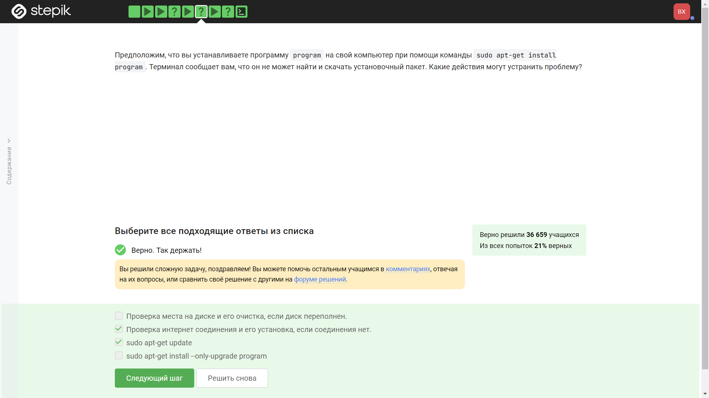

---
## Front matter
title: "Отчёт по рохождению внешних курсов"
subtitle: "Часть 2. Работа на сервере"
author: "Хрусталев Влад"

## Generic otions
lang: ru-RU
toc-title: "Содержание"

## Bibliography
bibliography: bib/cite.bib
csl: pandoc/csl/gost-r-7-0-5-2008-numeric.csl

## Pdf output format
toc: true # Table of contents
toc-depth: 2
lof: true # List of figures
lot: true # List of tables
fontsize: 12pt
linestretch: 1.5
papersize: a4
documentclass: scrreprt
## I18n polyglossia
polyglossia-lang:
  name: russian
  options:
	- spelling=modern
	- babelshorthands=true
polyglossia-otherlangs:
  name: english
## I18n babel
babel-lang: russian
babel-otherlangs: english
## Fonts
mainfont: PT Serif
romanfont: PT Serif
sansfont: PT Sans
monofont: PT Mono
mainfontoptions: Ligatures=TeX
romanfontoptions: Ligatures=TeX
sansfontoptions: Ligatures=TeX,Scale=MatchLowercase
monofontoptions: Scale=MatchLowercase,Scale=0.9
## Biblatex
biblatex: true
biblio-style: "gost-numeric"
biblatexoptions:
  - parentracker=true
  - backend=biber
  - hyperref=auto
  - language=auto
  - autolang=other*
  - citestyle=gost-numeric
## Pandoc-crossref LaTeX customization
figureTitle: "Рис."
tableTitle: "Таблица"
listingTitle: "Листинг"
lofTitle: "Список иллюстраций"
lotTitle: "Список таблиц"
lolTitle: "Листинги"
## Misc options
indent: true
header-includes:
  - \usepackage{indentfirst}
  - \usepackage{float} # keep figures where there are in the text
  - \floatplacement{figure}{H} # keep figures where there are in the text
---

# Цель работы

Изучить работу с серверами на Linux.

# Выполнение лабораторной работы

Вопрос 1: (рис. @fig:001).

{#fig:001 width=70%}

Пояснение ответа 1: Все ответы верны

Вопрос 2: (рис. @fig:002).

{#fig:002 width=70%}

Пояснение ответа 2: *.pub - ключ открытый, не имеет паролей.

Вопрос 3: (рис. @fig:003).

{#fig:003 width=70%}

Пояснение ответа 3: 

1) в терминале прописываем : ssh server1.stepik-local, чтобы подключиться

3) Прописываем: cat /srv/files_on_server/secret, чтобы посмтореть содержимое, увидим текст "I hacked ssh" 

4) прописываем: exit, чтобы отключиться от сервера

5) прописываем: echo "I hacked ssh" > /home/box/secret, чтобы создать файл и записать в него данный текст.

Вопрос 4: (рис. @fig:004).

{#fig:004 width=70%}

Пояснение ответа 4: -r значит рекурсия

Вопрос 5: (рис. @fig:005).

{#fig:005 width=70%}

Пояснение ответа 5: Пакет может не скачиваться, если нет интернета или в базе он ещё не присувует. Из этих рассуждений и взялись выбранные ответы.

Вопрос 6: (рис. @fig:006).

{#fig:006 width=70%}

Пояснение ответа 6: Поянения не требуется.

Вопрос 7: (рис. @fig:007).

{#fig:007 width=70%}

Пояснение ответа 7: 

"mkdir files_on_client" - создадим папку для задания

"scp -r box@server1.stepik-local:/srv/files_on_server/* /home/box/files_on_client/" - скопируем с помощью этой команды нужные файлы.

Вопрос 8: (рис. @fig:008).

{#fig:008 width=70%}

Пояснение ответа 8: Поясленния не требует.

Вопрос 9: (рис. @fig:009).

{#fig:009 width=70%}

Пояснение ответа 9: Поясления не требуются.

Вопрос 10: (рис. @fig:010).

{#fig:010 width=70%}

Пояснение ответа 10:

FastQC supports files in the following formats

FastQ (all quality encoding variants)
Casava FastQ files*
Colorspace FastQ
GZip compressed FastQ
SAM
BAM
SAM/BAM Mapped only (normally used for colorspace data)

Вопрос 11: (рис. @fig:011).

{#fig:011 width=70%}

Пояснение ответа 11: Поянения не требуется

Вопрос 12: (рис. @fig:012).

{#fig:012 width=70%}

Пояснение ответа 12: CTRL+C - завершает программу 1, поэтому ответ именно такой. А CTRL+Z - ставит на паузу.

Вопрос 13: (рис. @fig:013).

{#fig:013 width=70%}

Пояснение ответа 13: Поянения не требует.

Вопрос 14: (рис. @fig:014).

{#fig:014 width=70%}

Пояснение ответа 14: kill -9 завершает процесс без ожидания ответа.

Вопрос 15: (рис. @fig:015).

{#fig:015 width=70%}

Пояснение ответа 15: Поянения не требуется

Вопрос 16: (рис. @fig:016).

{#fig:016 width=70%}

Пояснение ответа 16: Т.к. процесс не работает, то 0%.

Вопрос 17: (рис. @fig:017).

{#fig:017 width=70%}

Пояснение ответа 17: Пояснения не требует

Вопрос 18: (рис. @fig:018).

{#fig:018 width=70%}

Пояснение ответа 18: Приложение многопоточно изначально. Завершить один поток - значит поломать приложениеж

Вопрос 19: (рис. @fig:019).

{#fig:019 width=70%}

Пояснение ответа 19: Требовалось посмотреть документацию. Ныне обе программы поддерживают многопоточность.

Вопрос 20: (рис. @fig:020).

{#fig:020 width=70%}

Пояснение ответа 20:

1) Запустил программу ./bowtie2-build с нужным файлом и индексом (см. уроки и описание задания). Можно запустить без ./, но для этого программу нужно установить с помощью sudo apt install bowtie2.

2) Запустил программу ./bowtie2 с индексом и вторым файлом (см. уроки и описание задания). Лог записал в один файл, ошибки в другой.

Вопрос 21: (рис. @fig:021).

{#fig:021 width=70%}

Пояснение ответа 21: Для fg - нужен рабочий процесс

Вопрос 22: (рис. @fig:022).

{#fig:022 width=70%}

Пояснение ответа 22: У tmux есть такая команда.

Вопрос 23: (рис. @fig:023).

{#fig:023 width=70%}

Пояснение ответа 23: Пояснения не требуется.

Вопрос 24: (рис. @fig:024).

{#fig:024 width=70%}

Пояснение ответа 24: Пояснения не требуется

Вопрос 25: (рис. @fig:025).

{#fig:025 width=70%}

Пояснение ответа 25: Пояснения не требуется

Вопрос 26: (рис. @fig:026).

{#fig:026 width=70%}

Пояснение ответа 26: Данное задание выполнялось опытным путём

# Выводы

На данной лабораторной мы укрепили свои знание о Linux, терминале.
