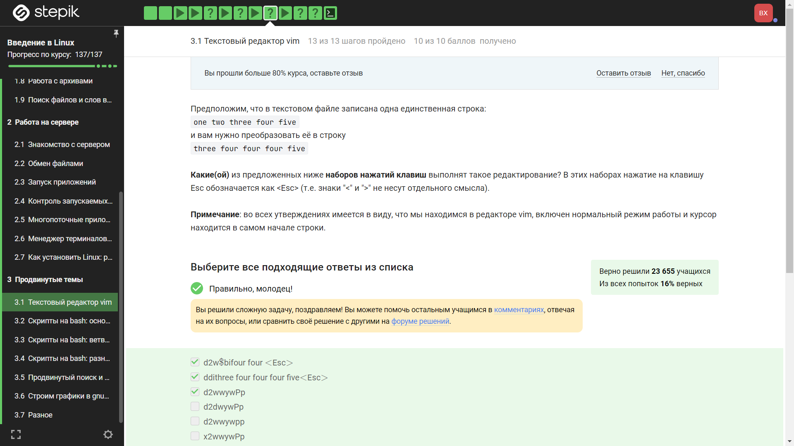
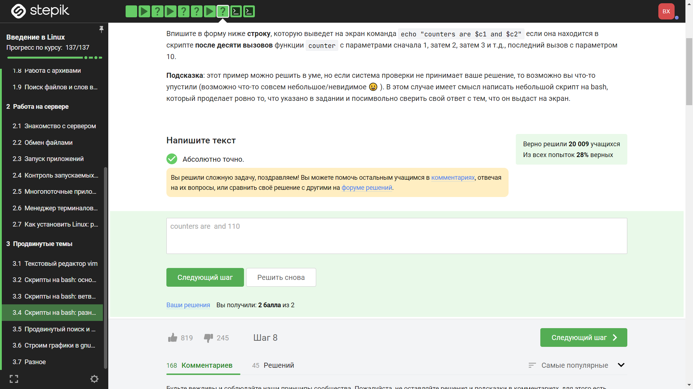
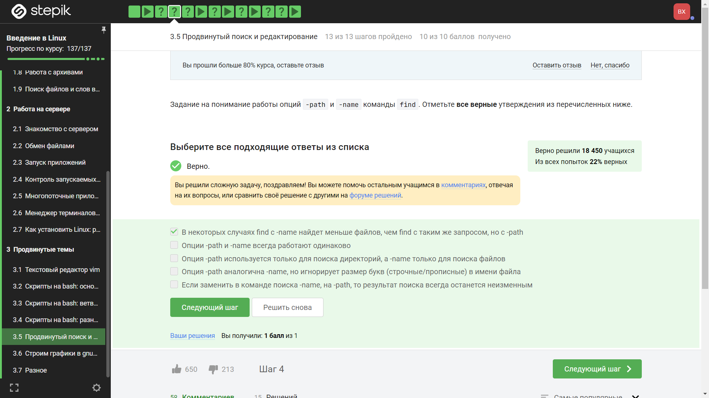

---
## Front matter
title: "Отчёт по рохождению внешних курсов"
subtitle: "Часть 3. Продвинутые темы"
author: "Хрусталев Влад"

## Generic otions
lang: ru-RU
toc-title: "Содержание"

## Bibliography
bibliography: bib/cite.bib
csl: pandoc/csl/gost-r-7-0-5-2008-numeric.csl

## Pdf output format
toc: true # Table of contents
toc-depth: 2
lof: true # List of figures
lot: true # List of tables
fontsize: 12pt
linestretch: 1.5
papersize: a4
documentclass: scrreprt
## I18n polyglossia
polyglossia-lang:
  name: russian
  options:
	- spelling=modern
	- babelshorthands=true
polyglossia-otherlangs:
  name: english
## I18n babel
babel-lang: russian
babel-otherlangs: english
## Fonts
mainfont: PT Serif
romanfont: PT Serif
sansfont: PT Sans
monofont: PT Mono
mainfontoptions: Ligatures=TeX
romanfontoptions: Ligatures=TeX
sansfontoptions: Ligatures=TeX,Scale=MatchLowercase
monofontoptions: Scale=MatchLowercase,Scale=0.9
## Biblatex
biblatex: true
biblio-style: "gost-numeric"
biblatexoptions:
  - parentracker=true
  - backend=biber
  - hyperref=auto
  - language=auto
  - autolang=other*
  - citestyle=gost-numeric
## Pandoc-crossref LaTeX customization
figureTitle: "Рис."
tableTitle: "Таблица"
listingTitle: "Листинг"
lofTitle: "Список иллюстраций"
lotTitle: "Список таблиц"
lolTitle: "Листинги"
## Misc options
indent: true
header-includes:
  - \usepackage{indentfirst}
  - \usepackage{float} # keep figures where there are in the text
  - \floatplacement{figure}{H} # keep figures where there are in the text
---

# Цель работы

Изучить подробнее некоторые темы и программы связаные с Linux.

# Выполнение лабораторной работы

Вопрос 1: (рис. @fig:001).

{#fig:001 width=70%}

Пояснение ответа 1: Пояснение не требуется

Вопрос 2: (рис. @fig:002) и (рис. @fig:003).

{#fig:002 width=70%}

{#fig:003 width=70%}

Пояснение ответа 2: Поянения не требуется.

Вопрос 4: (рис. @fig:004).

{#fig:004 width=70%}

Пояснение ответа 4: Проверка была опытным путём.

Вопрос 5: (рис. @fig:005).

{#fig:005 width=70%}

Пояснение ответа 5:  Общий синтаксис этой команды примерно такой: ":{пределы}s/{что заменяем}/{на что заменяем}/{опции}".

Вопрос 6: (рис. @fig:006).

{#fig:006 width=70%}

Пояснение ответа 6: Как и требовало задание проверка производилась опытным путём.

Вопрос 7: (рис. @fig:007).

{#fig:007 width=70%}

Пояснение ответа 7:

Последовательность действий

"wget https://stepic.org/media/attachments/course73/byron.txt.gz" - Скачать файл "byron.txt.gz" с помощью команды wget.

"gunzip byron.txt.gz" - Распаковать файл "byron.txt.gz" с помощью команды gunzip.

"vim byron.txt" - Открыть файл "byron.txt" в текстовом редакторе Vim.

":%s/Harold/Ivan/c" - В режиме редактирования в Vim заменить все вхождения "Harold" на "Ivan" во всем файле.

"нажать < y > на клаве" - Нажать клавишу "y" в редакторе Vim для копирования текущей строки.

":1000" - В редакторе Vim переместить курсор на 1000-ю строку.

"d1000d" - В редакторе Vim удалить 1000 строк, начиная с текущей строки.

":5" - В редакторе Vim переместить курсор на 5-ю строку.

"y7y" - В редакторе Vim скопировать 7 строк, начиная с текущей строки.

"<Shift> g (или G)" - В редакторе Vim переместить курсор в конец файла.

"o" - В редакторе Vim перейти в режим вставки и начать новую строку после текущей строки.

"p" - В редакторе Vim вставить скопированный текст после текущей строки.

":w /home/quiz/byron_edited.txt" - Сохранить изменения в файле Vim под указанным путем "/home/quiz/byron_edited.txt".

"<enter>" - Нажать клавишу "Enter" для выполнения предыдущей команды в редакторе Vim.

Вопрос 8: (рис. @fig:008).

{#fig:008 width=70%}

Пояснение ответа 8: 1 оболочка -> 2 оболочка -> 3 оболочка , т.е. мы в 3 уже и команды работают только внутри неё.

Вопрос 9: (рис. @fig:009).

{#fig:009 width=70%}

Пояснение ответа 9: Сначала мы создаём файл, потом уже переходим в другую папку. От этого местоположение файла не меняется.

Вопрос 10: (рис. @fig:010).

{#fig:010 width=70%}

Пояснение ответа 10: Названия могут состоят из всех букв латинского алфавита верхнего и нижнего регистра, цифр и "_".

Вопрос 11: (рис. @fig:011).

{#fig:011 width=70%}

Пояснение ответа 11: echo вовращает текст(выводит на экран), как требует то задание.

Вопрос 12: (рис. @fig:012) и (рис. @fig:013).

{#fig:012 width=70%}

{#fig:013 width=70%}

Пояснение ответа 12: 

Проведя пару тестов вышло:

Lie -e $1

True -e $0

Lie -n $1

True -n $0

Lie -s $1

True -s $0

True $varl

Lie $varl

svar2 || $varl != $var2

$var2 && $varl != $var2

Вопрос 14: (рис. @fig:014) и (рис. @fig:015).

{#fig:014 width=70%}

{#fig:015 width=70%}

Пояснение ответа 14: Провели тест программы, потом выбрали ответ.

Вопрос 16: (рис. @fig:016) и (рис. @fig:017).

{#fig:016 width=70%}

{#fig:017 width=70%}

Пояснение ответа 16: Код работает просто.  Сравнения: аргумент = 1 или аргумент больше 1 и меньше или равно 4, или аргумент 5 и больше и всё что иначе.

Вопрос 18: (рис. @fig:018).

{#fig:018 width=70%}

Пояснение ответа 18: Данная шпаргалка дала мне посчитать ответ для задачи: "a > c нет (Start, Finish)" и ", > c нет (Start, Finish)", и "b > c нет (Start, Finish)", и "c_d > c да (Start)".

Вопрос 19: (рис. @fig:019) и (рис. @fig:020).

{#fig:019 width=70%}

{#fig:020 width=70%}

Пояснение ответа 19: Данная программа анологична заданию 16, но тут уже 2 аргумента. Всё выполянется так: снчала проверяем имя , потом возраст и выводим нужный ответ

Вопрос 21: (рис. @fig:021).

{#fig:021 width=70%}

Пояснение ответа 21: Если текст в кавычках, то между переменными и символами может стоять пробел, иначе пробелов быть не должно. a+=b == a=a+b . Следоватьльно мы выбираем ответы. не знабываем про let.

Вопрос 22: (рис. @fig:022).

{#fig:022 width=70%}

Пояснение ответа 22: Т.к. в cd указан полный путь, то и pwd выведет полный путь.

Вопрос 23: (рис. @fig:023).

{#fig:023 width=70%}

Пояснение ответа 23:

Мы выбрали два ответа:

1. Сначала запустить program, затем if [[ $? -eq 0 ]]:
В данной конструкции сначала выполняется program, а затем проверяется его код возврата ($?). Если код возврата равен 0, то выполняются указанные действия внутри if.

2. if program > some_file.txt:
В этом случае программа program запускается, её вывод направляется в файл some_file.txt с помощью оператора перенаправления (>). Затем if выполняет проверку результата запуска program (т.е. код возврата). Если код возврата равен 0, выполняются действия внутри if.

Вопрос 24: (рис. @fig:024) и рис. @fig:025).

{#fig:024 width=70%}

{#fig:025 width=70%}

Пояснение ответа 24: 

С помощью данной программы я узнал ответ:

```bash
counter ()
{
      local let "c1+=$1"
        let "c2+=${1}*2"
}


for i in {1..10}
do
    counter i

done
    echo "counters are c1andc2"
```

Вопрос 26: (рис. @fig:026) и (рис. @fig:027).

{#fig:026 width=70%}

{#fig:027 width=70%}

Пояснение ответа 26:

Данный код представляет собой бесконечный цикл, который будет выполняться до тех пор, пока условие `true` истинно. Внутри цикла выполняется следующая последовательность действий:

1. Вводятся два числа `n1` и `n2`.

2. Проверяется условие `-z $n1`, которое проверяет, является ли значение переменной `n1` пустым.

   - Если `n1` является пустым, то выводится сообщение "bye", и цикл прерывается с помощью команды `break`.

   - Если `n1` не пустое, выполняются следующие действия.
   
3. Объявляется функция `gcd`, которая вычисляет наибольший общий делитель (НОД) двух чисел.

4. Если `n2` равно 0, выводится сообщение "bye".

5. В цикле выполняются следующие действия, пока значение `remainder` не станет равным 0:

   - Значение `remainder` вычисляется как остаток от деления `n1` на `n2`.
   
   - Значение `n1` присваивается `n2`.
   
   - Значение `n2` присваивается `remainder`.
   
6. После завершения цикла вычисления НОДа, выводится сообщение "GCD is `n1`", где `n1` - наибольший общий делитель введенных чисел.

Таким образом, код продолжает выполняться до тех пор, пока пользователь не введет пустое значение для `n1`, после чего выводит сообщение "bye" и завершается.

Вопрос 28: (рис. @fig:028) и (рис. @fig:029).

{#fig:028 width=70%}

{#fig:029 width=70%}

Пояснение ответа 28:

1. Скрипт начинается с указания, что используется оболочка Bash: `#!/bin/bash`.

2. Затем идет бесконечный цикл `while [[ True ]]`, который будет выполняться до тех пор, пока не будет выполнено условие выхода.

3. Внутри цикла `while` выполняется команда `read birinchi amal ikkinchi`, которая считывает три значения с ввода и сохраняет их в переменные `birinchi`, `amal` и `ikkinchi`.

4. Далее следует условная конструкция `if`, которая проверяет значение переменной `birinchi`. Если оно равно строке "exit", то выводится сообщение "bye", и цикл прерывается с помощью команды `break`.

5. Если значение переменной `birinchi` не равно "exit", то выполняется блок `else`.

6. Внутри блока `else` используется оператор `case` для проверки значения переменной `amal` на соответствие определенным операторам ("+", "-", "/", "*", "%", "**").

7. В зависимости от значения переменной `amal` выполняется соответствующая математическая операция над значениями `birinchi` и `ikkinchi` с помощью операторов `let`.

8. Результат операции сохраняется в переменной `result` и выводится на экран с помощью команды `echo "$result"`.

9. Если значение переменной `amal` не соответствует ни одному из заданных операторов, выводится сообщение "error", и цикл прерывается с помощью команды `break`.

Вопрос 30: (рис. @fig:030).

{#fig:030 width=70%}

Пояснение ответа 30: Команда `find /home/bi -iname "star*"` найдет все файлы и каталоги в директории `/home/bi` (и её поддиректориях), имена которых начинаются с букв "star" (независимо от регистра). Например, она найдет файлы с именами "star.txt", "star.jpg", "StAr123", "stArt" и т.д. Ключ `-iname` позволяет игнорировать регистр символов при сравнении имени файла. С другой стороны, команда `find /home/bi -name "star*"` найдет только файлы и каталоги, имена которых начинаются с букв "star", с учетом регистра символов. Например, она найдет файлы с именами "star.txt", "star.jpg", но не найдет файлы с именами "StAr123" или "stArt". Ключ `-name` учитывает регистр символов при сравнении имени файла.

Вопрос 31: (рис. @fig:031).

{#fig:031 width=70%}

Пояснение ответа 31: 

Верно, что в некоторых случаях команда `find` с опцией `-name` может найти меньше файлов, чем команда `find` с тем же запросом, но с опцией `-path`. Это происходит из-за различной логики, которая используется при сопоставлении шаблонов имен файлов.

Опция `-name` выполняет сопоставление шаблона только с базовым именем файла, игнорируя его путь или полное имя файла. Например, команда `find /home -name "file.txt"` будет искать файлы с именем "file.txt" только внутри директории `/home` и её поддиректориях. Если файл находится в другом месте, не совпадающем с путем `/home`, он не будет найден.

С другой стороны, опция `-path` выполняет сопоставление шаблона со всем путем (включая директории) и именем файла. Это означает, что команда `find` с опцией `-path` будет искать файлы, удовлетворяющие шаблону, во всех частях пути. Например, команда `find / -path "*file.txt"` будет искать файлы с именем "file.txt" в любом месте файловой системы.

Таким образом, если файлы, удовлетворяющие заданному шаблону, находятся в разных путях или поддиректориях, то команда `find` с опцией `-path` может найти больше файлов, чем команда `find` с опцией `-name`, которая сопоставляет только с базовым именем файла.

Остальные ответы не верные.

Вопрос 32: (рис. @fig:032).

{#fig:032 width=70%}

Пояснение ответа 32: По заднию минимальная глубина 2 и макс. 3. Из чего и следует ответ.

Вопрос 33: (рис. @fig:033).

{#fig:033 width=70%}

Пояснение ответа 33: Во всех случаях перенаправления вывода в один и тот же файл results.txt, каждая последующая команда перезапишет результаты предыдущей команды, таким образом в файл results.txt будет сохранен только результат последней команды. Поэтому, размер файла results.txt будет одинаковым во всех случаях - он будет содержать результаты только последней команды grep.

Вопрос 34: (рис. @fig:034).

{#fig:034 width=70%}

Пояснение ответа 34: знак "?" обозначает использование любого количества символов из диапазона(в нашем случае [xklXKL]) не более одного раза."$" означет конец строки после искомой части. [uU] просто диапазон, из которых выбирается от 1 до 2 сиволов в том же порядке.

Вопрос 35: (рис. @fig:035).

{#fig:035 width=70%}

Пояснение ответа 35: В данном случае, без опции -n, каждая строка, соответствующая шаблону [a-z]*, будет автоматически выведена на стандартный вывод дважды. Это происходит из-за того, что sed по умолчанию выводит каждую обработанную строку после применения всех команд. Первый раз строка будет выведена из-за использования команды p (которая выводит строки, соответствующие шаблону), а второй раз она будет выведена в конце, из-за стандартного поведения sed.

Вопрос 36: (рис. @fig:036) и (рис. @fig:037).

{#fig:036 width=70%}

{#fig:037 width=70%}

Пояснение ответа 36: Команда sed 's/ [A-Z]\{2,\} / abbreviation /g' input.txt > edited.txt выполняет замену всех последовательностей букв, состоящих из двух или более заглавных символов, на строку "abbreviation" в файле input.txt, сохраняя результат в файл edited.txt.

Вопрос 38: (рис. @fig:038).

{#fig:038 width=70%}

Пояснение ответа 38: Пояснение не требуется.

Вопрос 39: (рис. @fig:039).

{#fig:039 width=70%}

Пояснение ответа 39: Команда set key autotitle columnhead указывает, чтобы заголовок столбца в файле data.csv использовался в качестве автоматического названия ряда данных. Это означает, что первое значение из второго столбца будет использовано в качестве названия ряда. Команда plot 'data.csv' using 1:2 говорит программе gnuplot построить график, используя данные из файла data.csv. Она указывает, что для оси X будет использоваться первый столбец, а для оси Y - второй столбец. То название ряда данных будет "3" (первое значение из второго столбца), а на графике будет нарисовано 9 точек (данные из второго столбца, исключая первую строку).

Вопрос 40: (рис. @fig:040).

{#fig:040 width=70%}

Пояснение ответа 40:
set xtics: указывает, что мы настраиваем деления на оси X.

"point 1, value ".x1 x1: первая метка деления. Она будет отображаться как "point 1, value " (текст) с добавлением значения x1 (число).

"point 2, value ".x2 x2: вторая метка деления. Она будет отображаться как "point 2, value " (текст) с добавлением значения x2 (число).

"point 3, value ".x3 x3: третья метка деления. Она будет отображаться как "point 3, value " (текст) с добавлением значения x3 (число).

Вопрос 41: (рис. @fig:041).

{#fig:041 width=70%}

Пояснение ответа 41: Пояснение не требуется.

Вопрос 42: (рис. @fig:042).

{#fig:042 width=70%}

Пояснение ответа 42:

chmod ug+w file.txt; chmod u+x file.txt: В этой команде сначала устанавливаются права записи для владельца (u) и группы (g) файла с помощью ug+w. Затем устанавливается право выполнения для владельца (u+x). Результатом будет rwxrw-r--.

chmod u+wx file.txt; chmod g+w file.txt: В этом случае сначала устанавливается право чтения и записи для владельца (u+wx), а затем устанавливается право записи для группы (g+w). Результатом также будет rwxrw-r--.

chmod 764 file.txt: В этой команде непосредственно указываются числовые значения для прав доступа. Цифры соответствуют следующим правам: 7 - владелец (rwx), 6 - группа (rw-), 4 - остальные (r--). Таким образом, права доступа станут rwxrw-r--.

chmod a+wx file.txt; chmod o-wx file.txt; chmod g-x file.txt: В этой последовательности команд сначала устанавливаются права чтения, записи и выполнения для всех пользователей (a+wx). Затем удаляется право выполнения для группы (g-x) и право выполнения для остальных пользователей (o-wx). Результатом будет rwxrw-r--.

Вопрос 43: (рис. @fig:043) и (рис. @fig:044).

{#fig:043 width=70%}

{#fig:044 width=70%}

Пояснение ответа 43:

Верные варианты ответов, которые позволят пользователю из группы group создать файл внутри директории dir, следующие:

1. `sudo chown user:group dir`: Эта команда изменит владельца и группу директории dir на user и group соответственно. После выполнения этой команды, пользователь user из группы group будет иметь права записи в директорию dir.

2. `sudo chmod a+w dir`: Эта команда устанавливает права записи для всех пользователей (владелец, группа и остальные). Таким образом, пользователь из группы group будет иметь права записи в директорию dir.

3. `sudo chmod o+w dir`: Эта команда устанавливает права записи для остальных пользователей. В результате пользователь из группы group сможет создавать файлы в директории dir.

4. `sudo chown user dir`: Эта команда изменит только владельца директории dir на user. Группа не изменится. Если пользователь user принадлежит к группе group, то он сможет создавать файлы в директории dir, так как останутся права записи для группы.

Неверные варианты ответов:

1. `sudo chown :group dir`: Эта команда изменит только группу директории dir на group, не меняя владельца. Поскольку по умолчанию только владелец (root) имеет права записи в директорию, пользователь из группы group все равно не сможет создавать файлы.

2. `sudo chmod g+w dir`: Эта команда устанавливает права записи для группы на директорию dir. Однако, если пользователь не является владельцем директории или не принадлежит к группе group, эта команда не изменит права доступа для него, и он не сможет создавать файлы внутри dir.

Вопрос 45: (рис. @fig:045).

{#fig:045 width=70%}

Пояснение ответа 45: 

Из википедии узнали все ключи от wc:

  	 wc -l <filename> вывести количество строк
  	 
  	 wc -c <filename> вывести количество байт
  	 
  	 wc -m <filename> вывести количество символов
  	 
  	 wc -L <filename> вывести длину самой длинной строки
  	 
	 wc -w <filename> вывести количество слов

Вопрос 46: (рис. @fig:046).

{#fig:046 width=70%}

Пояснение ответа 46:

Команда `du` используется для вычисления общего размера файлов или директорий в системе.

- `-h` (или `--human-readable`): Этот ключ позволяет выводить размеры файлов в "читаемом" формате, то есть в удобных для чтения единицах измерения (например, KB, MB, GB). Например, вместо вывода размера в байтах, команда `du -h` покажет размеры в килобайтах, мегабайтах или гигабайтах, в зависимости от размера.

- `-s` (или `--summarize`): Этот ключ используется для вывода только общего размера указанного объекта (файла или директории), без детализации по каждому файлу. Когда используется ключ `-s`, команда `du` выводит только одну строку, содержащую суммарный размер объекта.

Вопрос 47: (рис. @fig:047).

{#fig:047 width=70%}

Пояснение ответа 47: выполянется команда mkdir dir{1..3} {1..3} - означет, что число меняется от 1 до 3.

# Выводы

На данной лабораторной мы укрепили свои знание о Linux, терминале.
